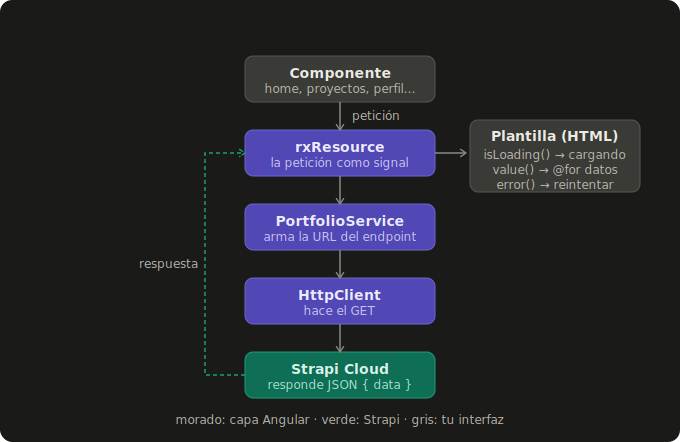
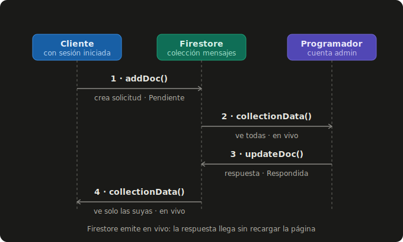

# Portafolio Profesional — David Larriva

Aplicación web tipo portafolio con contenido administrado desde StrapiCloud, inicio de sesión y solicitudes de contacto en tiempo real desde Firebase. Proyecto Integrador de **Programación y Plataformas Web**.

🔗 **Link:** https://portafolio-david-5ba22.web.app

---

## Qué es

Un portafolio donde el contenido (programador, proyectos y servicios) se administra desde **Strapi** y se muestra en una app de **Angular**. Los visitantes pueden registrarse, enviar una solicitud de contacto y ver la respuesta; yo, desde mi cuenta, gestiono todas las solicitudes.

## Stack

- **Angular 21** — standalone components, signals y control flow (`@if` / `@for`).
- **rxResource** — consumo reactivo de Strapi con estados de carga y error automáticos.
- **Tailwind CSS v3** — diseño minimalista en escala de grises.
- **Strapi** (CMS Headless) — contenido del portafolio vía API REST.
- **Firebase** — Authentication (login) y Cloud Firestore (solicitudes).

---

## Cómo se consumen los datos de Strapi

Cada componente declara un `rxResource`, que pide los datos a `PortfolioService`, este arma la URL y `HttpClient` hace el `GET`. La respuesta vuelve como tres señales que la plantilla lee directamente.



`rxResource` entrega tres señales listas para usar en el HTML:

| Señal | Qué entrega |
|-------|-------------|
| `value()` | los datos (o `defaultValue: []` mientras llegan) |
| `isLoading()` | `true` mientras la petición está en curso |
| `error()` | el error, si la petición falla |

Peticiones y dónde se consumen:

| Endpoint | Método (`PortfolioService`) | Dónde se usa | Qué muestra |
|----------|------------------------------|--------------|-------------|
| `/programadors?populate=*` | `getProgramadores()` | `home-page.ts`, `contact-page.ts` | tarjetas + select |
| `/programadors?filters[slug]=…` | `getProgramadorPorSlug()` | `profile-page.ts` | perfil individual |
| `/proyectos?populate=*` | `getProyectos()` | `projects-page.ts` | todos los proyectos |
| `/proyectos?filters[destacado]=true` | `getProyectosDestacados()` | `home-page.ts` | destacados (Home) |
| `/servicios?populate=*` | `getServicios()` | `home-page.ts` | servicios |

---

## Solicitudes en tiempo real Firebase

El login usa **Firebase Auth** y las solicitudes se guardan en **Cloud Firestore**. Como `collectionData` es un stream en vivo, cuando respondo una solicitud el cliente ve la respuesta sin recargar.



Mismo panel (`/dashboard`), dos vistas según el rol: el cliente ve **solo sus** solicitudes en modo lectura; yo veo **todas** y puedo responder.

---

## Ejecutar en local

Requisitos: Node.js, pnpm y una instancia de Strapi corriendo.

```bash
# Strapi (en su propio proyecto) queda en http://localhost:1337
npm run develop

# Frontend (este proyecto)
pnpm install
pnpm start            # http://localhost:4200
```

La URL de Strapi no está quemada en el código: sale de `src/environments/`. `ng serve` usa la local y `ng build` usa la de la nube (intercambio automático vía `angular.json`).

## Desplegar

```bash
pnpm build
firebase deploy --only hosting
```

Hosting ya configurado: `firebase.json` publica `dist/portafolio-david/browser` con *rewrite* SPA hacia `index.html`.

---

## Roles

- **Visitante:** explora Home, proyectos, servicios y el perfil individual. Para escribir debe registrarse.
- **Usuario registrado:** envía solicitudes y ve sus respuestas en el panel.
- **Programador (admin):** ve todas las solicitudes, cambia su estado y responde.
